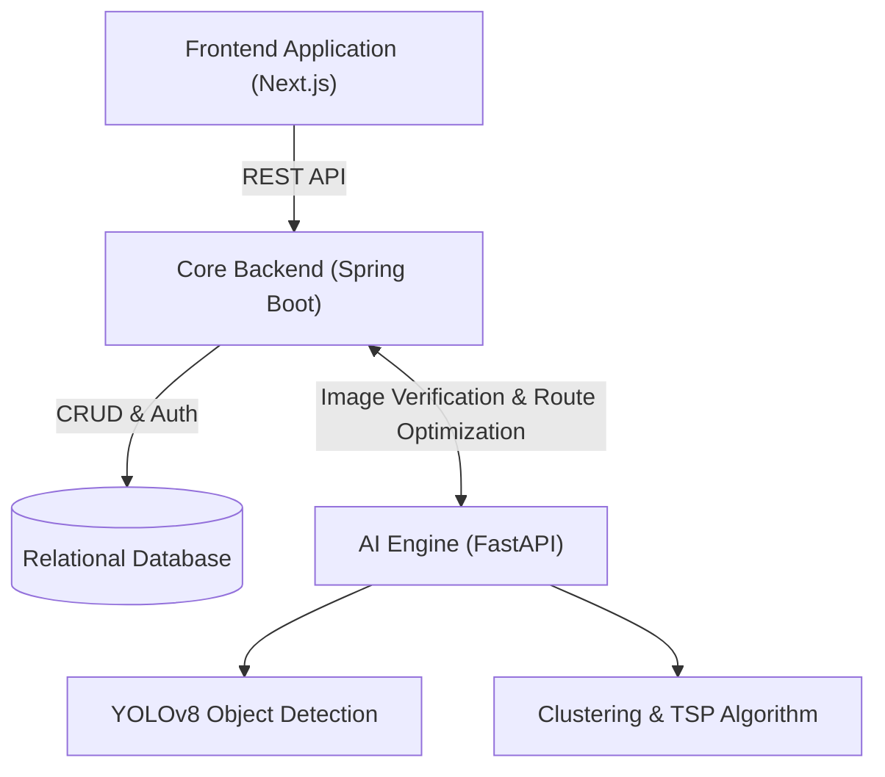

# Chokho AI

Chokho AI is a waste management and route optimization platform. It connects citizens, municipal administrators, and waste collection workers to create a streamlined, data-driven approach to city cleanliness.

## System Architecture

The platform is designed using a microservices-inspired architecture, divided into three distinct components.



### 1. Frontend (Next.js)
The frontend is built with Next.js 16 and React 19, utilizing Tailwind CSS for styling and Radix UI for accessible components. It features three distinct dashboards:
- **Citizen Dashboard**: Report waste issues, upload images, and track complaint statuses.
- **Worker Dashboard**: View optimized collection routes and verify waste clearance.
- **Admin Dashboard**: Monitor city-wide metrics, manage personnel, and view heatmaps via Leaflet integrations.

### 2. Core Backend (Spring Boot)
The core backend runs on Spring Boot 4 and Java 23. It serves as the primary gateway for the frontend applications, handling:
- JWT-based authentication and role authorization.
- Persistence of Users, Complaints, Vehicles, and Routes using JPA Repositories.
- Orchestration between user requests and the Python AI services.

### 3. AI Engine (FastAPI)
The Python backend specializes in heavy computational tasks that Java delegates to it:
- **Waste Detection**: Utilizes YOLOv8 models (`best.pt`) to detect and classify waste from images uploaded by citizens and workers.
- **Route Optimization**: Implements KMeans clustering and a nearest-neighbor Traveling Salesperson Problem (TSP) algorithm to generate the most efficient collection routes for workers based on pending complaints.

## Getting Started

### Prerequisites
- Node.js (v18+)
- Java 23
- Python 3.10+
- Maven

### Running the Services

**Frontend**
```bash
cd frontend
npm install
npm run dev
```

**Core Backend**
```bash
cd backend
./mvnw spring-boot:run
```

**Python AI Engine**
```bash
cd python-backend
pip install -r requirements.txt
python main.py
```

